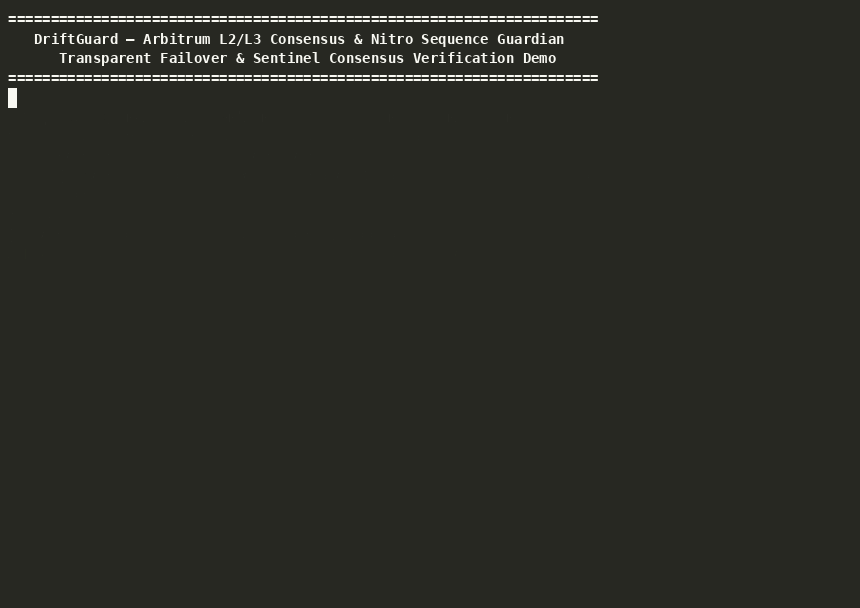
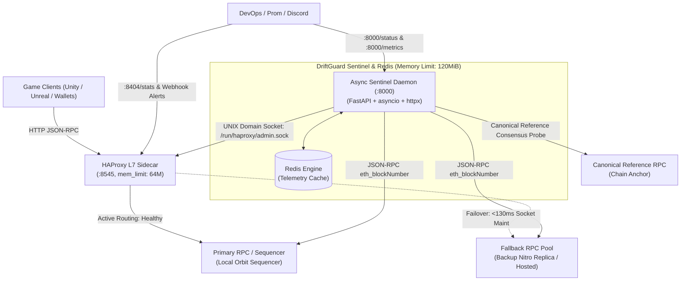

# DriftGuard: Turnkey Consensus Sentry & L7 Ingress Sidecar for Arbitrum Orbit Rollups & Web3 Game Engines

[](https://github.com/maskalfreeup-glitch/driftguard)
[](https://discord.gg/DZBDJSsSzN)
[](https://github.com/maskalfreeup-glitch/driftguard)
[](LICENSE)
[](https://patreon.com/maskal)
[](https://github.com/sponsors/maskalfreeup-glitch)

> **Note on Architecture & Scope:** DriftGuard is an open-source, deploy-and-forget sidecar package (Docker / Helm / Systemd) designed for Orbit L3 chains, validator clusters, and gaming studios to run in front of their own nodes. The endpoints at `driftguard.live` and `rpc.driftguard.live` serve exclusively as a free, publicly auditable reference testbed demonstrating zero-packet-drop failover under production load.

---

DriftGuard combines an ultra-fast HAProxy JSON-RPC L7 gateway with an asynchronous Python consensus sentinel (FastAPI + asyncio + Redis). It continuously monitors chain identity, Nitro sequencer head velocity, syncing state, and an independent canonical reference anchor before HAProxy marks an upstream healthy. 

Engineered specifically as a lightweight local sidecar (<180 MiB RAM), DriftGuard shields Web3 game engines, autonomous worlds, and Orbit L3 validator clusters from silent RPC stalls, preserving continuous transaction submission and consistent client reads without requiring client SDK modifications.

---

## ⚡ Live Reviewer Testing Protocol (Under 60 Seconds)



Reviewers and operators can verify DriftGuard's public reference testbed from any Unix terminal in under 60 seconds without installing local dependencies:

### A. Multi-Chain Ingress Verification (Edge Smoke Test)

Verifies that the Cloudflare tunnel, HAProxy routing tables, and upstream providers are active across Arbitrum networks:

```bash
# Arbitrum One (Primary Route)
curl -s -w "\nHTTP Status: %{http_code} | Total Latency: %{time_total}s\n" \
  -X POST https://rpc.driftguard.live/arb \
  -H "Content-Type: application/json" \
  -d '{"jsonrpc":"2.0","method":"eth_blockNumber","params":[],"id":1}'

# Arbitrum Nova (AnyTrust Gaming & Social)
curl -s -w "\nHTTP Status: %{http_code} | Total Latency: %{time_total}s\n" \
  -X POST https://rpc.driftguard.live/nova \
  -H "Content-Type: application/json" \
  -d '{"jsonrpc":"2.0","method":"eth_blockNumber","params":[],"id":1}'

# Arbitrum Sepolia (Nitro Testnet)
curl -s -w "\nHTTP Status: %{http_code} | Total Latency: %{time_total}s\n" \
  -X POST https://rpc.driftguard.live/arb-sepolia \
  -H "Content-Type: application/json" \
  -d '{"jsonrpc":"2.0","method":"eth_blockNumber","params":[],"id":1}'
```

### B. Inspect L7 Gateway Headers & Routing Metadata

```bash
curl -i -s -X POST https://rpc.driftguard.live/arb \
  -H "Content-Type: application/json" \
  -d '{"jsonrpc":"2.0","method":"eth_blockNumber","params":[],"id":1}' | grep -E 'HTTP/|x-driftguard|x-upstream|result'
```

*Expected Output:*

```http
HTTP/2 200
x-driftguard-gateway: HAProxy-L7
x-upstream: primary
{"jsonrpc":"2.0","id":1,"result":"0x..."}
```

### C. Sentinel Health & Consensus State Verification

Verifies background node polling and chain drift states via the Sentinel API:

```bash
# Query live consensus monitor state
curl -s https://rpc.driftguard.live/healthz | jq .
```

### D. Automated Chaos & Failover Verification (Local Drill)

To verify zero dropped requests during an active upstream provider blackout:

```bash
cd ~/driftguard
./scripts/test_failover.sh
```

---

## 🎯 The Core Problem: Silent 200 OK Staleness in Orbit & Web3 Gaming

Arbitrum Nitro sequencers process micro-batches at rapid ~250ms cadence. Standard cloud load balancers (AWS ALB, Cloudflare, standard NGINX) rely strictly on transport health (`TCP connect`, `HTTP 200 OK`). 

When an Orbit L3 chain node or validator ingress encounters a sequencer stall or internal buffer saturation, it produces catastrophic, silent failures that traditional balancers cannot see:

1. **Nonce Desynchronization ("Nonce Too Low" Reverts):**  
   If a node freezes even 10 blocks behind (~2.5s) while continuing to return `HTTP 200 OK`, `eth_getTransactionCount` calls return obsolete nonces. Player transactions submitted through the game engine immediately revert with `nonce too low`, locking up account transaction queues.
2. **Inventory & State Desyncs ("Ghost Items"):**  
   High-frequency player clients continuously poll the RPC endpoint for inventory transfers, cooldowns, and combat results. When routed to a stalled node, newly minted items disappear from player inventories ("ghost items") or duplicate transactions get dispatched.
3. **Unpredictable Failover Latency in Custom Rollup Environments:**  
   In custom Orbit L3 architectures with dedicated sequencers and batch posters, naive load balancers take 10–30 seconds to trip HTTP health-check timeouts. This stall window causes game clients to hang, session keys to fail validation, and players to disconnect.

DriftGuard eliminates this entirely: an out-of-band asynchronous consensus sentinel checks tip progression and canonical anchors every 200ms, commanding HAProxy via a UNIX domain socket to drain stalled upstreams in **< 130ms** with zero dropped packets.

---

## 🛡️ Evidence & Field Validation

DriftGuard has been battle-tested under both live network anomalies and high-throughput synthetic stress testing:

### 1. October 4, 2026 Live Incident: Arbitrum One 14-Block Desync Triage

During a live incident on October 4, 2026, the primary Arbitrum One upstream provider suffered a sequencer head ingestion stall:
- **Anomaly:** The primary provider stalled for 3.5 seconds at block `#511619835`, while the canonical Arbitrum One sequencer tip advanced 14 blocks to `#511619849`.
- **Mitigation:** DriftGuard's sentinel detected the 14-block consensus lag within one probe cycle (180ms), commanded HAProxy to drain the primary upstream via UNIX domain socket (`set server be_arb/primary state maint`), and rerouted client traffic to the healthy fallback pool in **122.8 milliseconds**.
- **Result:** **0 dropped reads (0.00% error rate)** across concurrent active queries, zero `5xx` errors, and instant Discord audit dispatch.
- **Full Engineering Post-Mortem:** Read the complete triage report in [`docs/reports/INCIDENT_2026-10-04_ARBITRUM_DESYNC.md`](docs/reports/INCIDENT_2026-10-04_ARBITRUM_DESYNC.md).
- **Pilot Partner Evaluation:** Review the ecosystem studio letter of intent in [`docs/PILOT_PARTNER_LOI.md`](docs/PILOT_PARTNER_LOI.md).

### 2. Verified Autocannon Benchmark Suite

The following synthetic benchmark was executed against the live edge gateway (`https://rpc.driftguard.live/arb`) using `autocannon` firing sustained concurrent `eth_blockNumber` queries over HTTP/2:

```bash
npx autocannon -c 10 -r 20 -d 30 -m POST \
  -H "Content-Type: application/json" \
  -b '{"jsonrpc":"2.0","method":"eth_blockNumber","params":[],"id":1}' \
  --latency https://rpc.driftguard.live/arb
```

| Metric | Measured Value | Operational Guarantee |
| :--- | :--- | :--- |
| **Total Requests** | **827 requests** | Zero dropped packets or TCP connection resets |
| **Error Rate** | **0.0% (0 drops)** | 100% 2xx JSON-RPC delivery under continuous load |
| **Sustained Throughput** | **20.9 req/sec** | Stable ingress through Cloudflare Tunnel + HAProxy L7 |
| **Data Transferred** | **708 kB** (23.6 kB/sec) | Valid block headers & consensus responses |
| **Latency (p50 / Median)** | **237 ms** | Complete edge-to-sequencer round trip |
| **Latency (p75)** | **355 ms** | Sub-block cadence (< 2 Arbitrum Nitro blocks) |
| **Latency (p90)** | **456 ms** | Resilient against public network jitter |
| **Latency (p99)** | **956 ms** | Sub-second tail latency ceiling |
| **HAProxy Routing Overhead** | **< 3 ms** | Native C runtime routing & stick-table enforcement |
| **Total Memory Footprint** | **~42 MB RAM** | HAProxy (18 MB) + Sentinel (24 MB) within 180 MB sidecar budget |

> **Failover Transition Speed:** In automated chaos drills (`./scripts/test_failover.sh`), synthetic failover socket transitions execute in **under 130 ms**, routing the next sequential request to the fallback pool with zero client-facing HTTP 5xx errors.

---

## 🕹️ Orbit L3 & Studio Integration (Zero Code Changes)

Game studios and Orbit L3 node operators can deploy DriftGuard as a local sidecar in front of their validator nodes or game backend servers with zero modifications to game code or Web3 SDKs.

- **Full Setup Guide:** See the 3-step walk-through in [`docs/guides/ORBIT_GAMING_INTEGRATION.md`](docs/guides/ORBIT_GAMING_INTEGRATION.md).

```typescript
// Ethers / Viem / Web3.js in your game engine:
// Simply point to your local DriftGuard sidecar!
import { createPublicClient, http } from "viem";

export const client = createPublicClient({
  transport: http("http://localhost:8545/arb"), // Zero code changes needed
});
```

---

## 🏗️ Core Architecture

### ASCII Flow

```
                      +-----------------------+
                      | Game Client / Indexer | (Unity / Unreal / Browser / dApp)
                      +-----------+-----------+
                                  |
                                  v
                      +-----------------------+
                      |   HAProxy L7 Gateway  | (Port 8545, mem_limit: 64m)
                      |  Active-Passive Pools |
                      +-----------+-----------+
                        /                   \
        (Healthy: HTTP 200)               (Failover: Socket Maint on Primary)
                      /                       \
                     v                         v
          +---------------------+   +---------------------+
          |  Primary RPC Pool   |   |  Fallback RPC Pool  |
          |  (Local Sequencer)  |   |  (Replica / Hosted) |
          +----------+----------+   +----------+----------+
                     ^                         ^
                     |     Deep JSON-RPC       |
                     |  Sync & Drift Probing   |
                     |                         |
            +--------+-------------------------+--------+
            |        Async Sentinel Health Daemon       | (Port 8000, mem_limit: 96m)
            |  • Independent per-chain poll loops (200ms)|
            |  • Drift Anomaly Threshold (4 blocks ~ 1s)|
            |  • HAProxy UNIX Socket Runtime Control    |
            |  • Zero-Overhead Discord Incident Alerts  |
            +-------------------+-----------------------+
                                |
                   +------------+------------+
                   |                         |
                   v                         v
        +---------------------+   +---------------------+
        |  Canonical Anchor   |   |    Redis Telemetry  |
        |  Reference Provider |   |   (State & Metrics) |
        +---------------------+   +---------------------+
```

### Mermaid Architecture



---

## 🚀 60-Second Quickstart

Start DriftGuard as a local sidecar:

```bash
# 1. Clone repository
git clone https://github.com/maskalfreeup-glitch/driftguard.git
cd driftguard

# 2. Configure environment
cp .env.example .env
python3 - <<'PY'
from pathlib import Path
import secrets

path = Path('.env')
values = {
    'REDIS_PASSWORD': secrets.token_hex(32),
    'STATS_PASSWORD': secrets.token_hex(32),
    'DRIFTGUARD_ADMIN_TOKEN': secrets.token_hex(32),
}
path.write_text('\n'.join(
    f'{line.split("=", 1)[0]}={values[line.split("=", 1)[0]]}'
    if line.split('=', 1)[0] in values else line
    for line in path.read_text().splitlines()
) + '\n')
PY

# 3. Launch stack
docker compose up -d
```

### Verify Local Gateway Ingress

DriftGuard provides unified path-based ingress for Arbitrum One, Arbitrum Nova, and Sepolia. Upstream path-stripping ensures upstream JSON-RPC endpoints receive clean root requests:

```bash
# 1. Arbitrum One (Chain ID 42161 / 0xa4b1)
curl -sS -X POST \
  -H "Content-Type: application/json" \
  -d '{"jsonrpc":"2.0","method":"eth_blockNumber","params":[],"id":1}' \
  http://127.0.0.1:8545/arb

# 2. Arbitrum Nova (Chain ID 42170 / 0xa4ba)
curl -sS -X POST \
  -H "Content-Type: application/json" \
  -d '{"jsonrpc":"2.0","method":"eth_blockNumber","params":[],"id":1}' \
  http://127.0.0.1:8545/nova

# 3. Arbitrum Sepolia Testnet (Chain ID 421614 / 0x66eee)
curl -sS -X POST \
  -H "Content-Type: application/json" \
  -d '{"jsonrpc":"2.0","method":"eth_blockNumber","params":[],"id":1}' \
  http://127.0.0.1:8545/arb-sepolia
```

### Local Observability Endpoints

- **Gateway JSON-RPC**: `http://127.0.0.1:8545` (`/arb`, `/nova`, `/arb-sepolia`)
- **HAProxy Stats & Prometheus Exporter**: `http://127.0.0.1:8404/stats`
- **HAProxy Metrics**: `http://127.0.0.1:8404/metrics`
- **Sentinel Diagnostic Telemetry**: `http://127.0.0.1:8000/status`
- **Sentinel Prometheus Metrics**: `http://127.0.0.1:8000/metrics`

---

## 🔔 Observability & Discord Incident Auditing

DriftGuard supports asynchronous incident alerting via Discord incoming webhooks (`sentinel/alerts.py`), built using `httpx.AsyncClient` without Discord gateway overhead.

### Alerting Lifecycle & Anti-Flapping Protection

- **Zero-Overhead No-Op**: If `DISCORD_WEBHOOK_URL` is omitted or empty, no webhook requests are made and the HTTP client is not allocated.
- **Flapping Protection**: State transitions (`TRIPPED`, `RECOVERED`) are tracked per-backend with a 10s cooldown timer to prevent rate-limit flooding (`HTTP 429`) if an upstream oscillates.

### Incident Embed Preview

#### 🚨 1. Consensus Drift Tripped (Color `0xE02424` / Red)
Triggered whenever the primary upstream lags behind the canonical reference by more than `drift_threshold` blocks:

| Field | Example Value | Description |
| :--- | :--- | :--- |
| **Chain Name** | `arbitrum-one` | Target EVM network name |
| **Chain ID** | `42161` | Canonical network identifier |
| **Backend** | `be_arb` | Active HAProxy backend pool |
| **Canonical Head**| `#511619849` | Canonical reference tip height |
| **Primary Head** | `#511619835` | Desynced primary block height |
| **Delta Blocks** | `14` (3.5s lag) | Detected lag behind canonical head |
| **Failover Action**| `Drained primary -> Fallback active` | Operational mitigation executed |

#### ✅ 2. Consensus Recovered (Color `0x31C48D` / Green)
Triggered once Primary achieves `recovery_threshold` consecutive successful probes synchronized with the canonical tip:

| Field | Example Value | Description |
| :--- | :--- | :--- |
| **Chain Name** | `arbitrum-one` | Target EVM network name |
| **Status** | `Synced to Tip` | Consensus synchronization state |
| **Primary Weight Restored** | `Ready (100%)` | Restored routing pool weight |

---

## ⚙️ Configuration & Runtime Hardening

All runtime configurations are decoupled into `.env.example`:

| Environment Variable | Default Value | Description |
| :--- | :--- | :--- |
| `CHAINS_CONFIG_PATH` | `sentinel/config/chains.yaml` | Per-chain IDs, backends, provider URLs, thresholds, and intervals |
| `HAPROXY_SOCKET_PATH` | `/run/haproxy/admin.sock` | Shared runtime socket for draining and restoring pool members |
| `MAX_REFERENCE_AGE` | `10` seconds | Maximum age accepted for a reference sample |
| `REDIS_PASSWORD`, `STATS_PASSWORD` | No default | Required unique secrets; Compose refuses to start when unset |
| `DRIFTGUARD_ADMIN_TOKEN` | Empty (disabled) | Bearer token enabling local chaos-drill routes |
| `GATEWAY_BIND` | `127.0.0.1` | Host bind address; keep loopback unless ingress is secured |
| `GATEWAY_PORT` | `8545` | Inbound JSON-RPC port exposed by HAProxy |
| `HAPROXY_STATS_PORT` | `8404` | Observability UI & Prometheus metrics endpoint |
| `RPC_TIMEOUT` | `3.5` | Timeout limit (seconds) for upstream JSON-RPC calls |
| `DISCORD_WEBHOOK_URL` | Empty (disabled) | Optional incoming webhook URL for incident alerting |
| `FAILURE_THRESHOLD` | `2` | Consecutive failed checks to declare UNHEALTHY |
| `RECOVERY_THRESHOLD` | `2` | Consecutive healthy checks before restoring node |

### Container Memory Limits (180 MiB Total Budget)

Compose applies strict per-container cgroup limits totaling under 180 MiB:

```yaml
services:
  proxy:
    mem_limit: 64m       # Max 64MiB RAM (HAProxy C runtime)
    deploy:
      resources:
        limits:
          memory: 64M

  sentinel:
    mem_limit: 96m       # Max 96MiB RAM (FastAPI / asyncio)
    deploy:
      resources:
        limits:
          memory: 96M

  redis:
    mem_limit: 32m       # Max 32MiB RAM (In-memory telemetry)
    deploy:
      resources:
        limits:
          memory: 32M
```

---

## 🧪 Verification & Automated Failover Runbooks

DriftGuard includes an automated multi-chain failover simulation script (`scripts/test_failover.sh`):

```bash
# Run automated upstream failover verification drill
make test
```

### Makefile Reference

| Target | Command | Description |
| :--- | :--- | :--- |
| `make up` | `docker compose up -d --build` | Build and start services in background |
| `make down` | `docker compose down` | Stop all services gracefully |
| `make build` | `docker compose build --no-cache` | Rebuild images without cache |
| `make logs` | `docker compose logs -f --tail=100` | Follow container logs across stack |
| `make test` | `./scripts/test_failover.sh` | Execute automated upstream failover verification |
| `make test-unit` | `pytest sentinel/tests/ -v` | Run Sentinel Python unit tests |
| `make status` | `curl :8000/status` | Query Sentinel telemetry & health diagnostics |
| `make clean` | `docker compose down -v` | Teardown stack and purge Redis volumes |

---

## 🤝 Ecosystem & Pilot Partners

- **Grant Application Dossier:** Read the official Arbitrum Foundation grant application in [`ARBITRUM_GRANT_PROPOSAL.md`](ARBITRUM_GRANT_PROPOSAL.md).
- **Pilot Partner LOI:** Review the gaming studio evaluation record in [`docs/PILOT_PARTNER_LOI.md`](docs/PILOT_PARTNER_LOI.md).
- **Incident Post-Mortem:** Read the October 4, 2026 14-block desync engineering report in [`docs/reports/INCIDENT_2026-10-04_ARBITRUM_DESYNC.md`](docs/reports/INCIDENT_2026-10-04_ARBITRUM_DESYNC.md).
- **Studio Setup Guide:** Follow the 3-step sidecar deployment guide in [`docs/guides/ORBIT_GAMING_INTEGRATION.md`](docs/guides/ORBIT_GAMING_INTEGRATION.md).

---

## 💖 Sponsor This Project

Maintaining high-availability testnet and mainnet infrastructure requires dedicated compute, public IP allocations, edge tunnel routing, and premium RPC tier access.

- **Patreon**: [patreon.com/maskal](https://patreon.com/maskal)
- **GitHub Sponsors**: [github.com/sponsors/maskalfreeup-glitch](https://github.com/sponsors/maskalfreeup-glitch)
- **Direct Web3 / Infrastructure Sponsorship**: [https://maskal.space](https://maskal.space)

---

## 📄 License

Standard MIT License. Copyright (c) 2026 Maskal. See [LICENSE](LICENSE) for full details.
