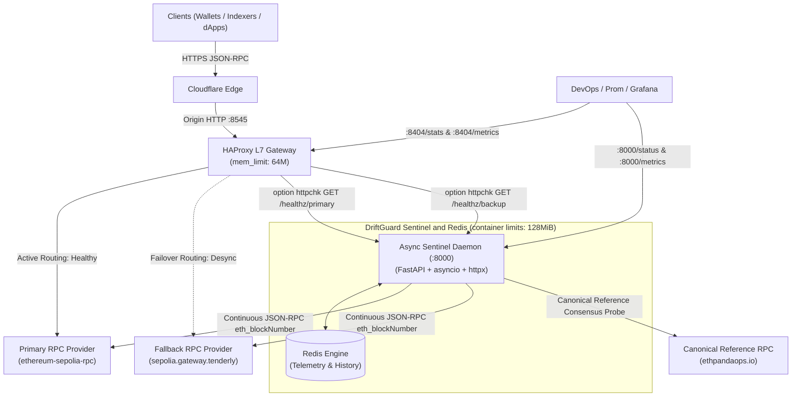

# DriftGuard

[](https://github.com/maskalfreeup-glitch/driftguard)
[](https://github.com/maskalfreeup-glitch/driftguard)
[](LICENSE)
[](https://patreon.com/maskal)
[](https://github.com/sponsors/maskalfreeup-glitch)

**High-Availability EVM JSON-RPC Failover Gateway & Consensus Drift Circuit Breaker.**

DriftGuard combines an HAProxy JSON-RPC gateway with an asynchronous Python sentinel. The sentinel checks chain identity, head height, syncing state, and a canonical reference before HAProxy marks an upstream healthy. It is an experimental, single-host failover tool; failover time and request continuity depend on polling intervals, provider behavior, and deployment topology. The included drill measures a synthetic health transition and confirms a subsequent request is served by the fallback. It does not establish a zero-error SLA.

---

## Live Sepolia Endpoint

- **Production Gateway:** [https://rpc.maskal.space](https://rpc.maskal.space)
- **Target Network:** Ethereum Sepolia Testnet (Chain ID: `11155111` / `0xaa36a7`)
- **Ingress Layer:** Cloudflare Edge $\rightarrow$ HAProxy L7 Gateway $\rightarrow$ DriftGuard Sentinel Stack

```bash
# Query the canonical head block number
curl -sS -X POST \
  -H "Content-Type: application/json" \
  -d '{"jsonrpc":"2.0","method":"eth_blockNumber","params":[],"id":1}' \
  https://rpc.maskal.space
```

```bash
# Query chain ID verification
curl -sS -X POST \
  -H "Content-Type: application/json" \
  -d '{"jsonrpc":"2.0","method":"eth_chainId","params":[],"id":2}' \
  https://rpc.maskal.space
```

---

## The Problem: Silent Consensus Drift

Standard load balancers (Nginx, Traefik, Envoy, AWS ALB) rely on transport health (TCP connect, HTTP 200). In decentralized EVM infrastructure, this creates catastrophic blind spots:

1. **Silent Stale Heads**: An RPC node can return `HTTP 200 OK` while stalled 50 blocks behind the canonical head, tricking wallets and liquidation bots into executing on obsolete state.
2. **Background Syncing (`eth_syncing = true`)**: Nodes catching up after a restart still respond to queries, returning inconsistent balances and missing transaction receipts.
3. **Flapping Circuit Breakers**: Brief latency spikes cause naive balancers to flap between upstreams, triggering connection resets and nonce collisions.

DriftGuard resolves this by continuously benchmarking upstreams against a trusted canonical reference RPC, tripping HAProxy health checks before stale state impacts end users.

---

## Core Architecture

### ASCII Flow

```
                      +-----------------------+
                      |    Cloudflare Edge    | (HTTPS / WAF / Ingress)
                      +-----------+-----------+
                                  |
                                  v
                      +-----------------------+
                      |   HAProxy L7 Gateway  | (Port 8545, mem_limit: 64m)
                      |  Active-Passive Pools |
                      +-----------+-----------+
                        /                   \
        (Healthy: HTTP 200)               (Failover: HTTP 503 on Primary)
                      /                       \
                     v                         v
          +---------------------+   +---------------------+
          |  Primary RPC Pool   |   |  Fallback RPC Pool  |
          |  (PublicNode / L1)  |   |  (Tenderly / Backup)|
          +----------+----------+   +----------+----------+
                     ^                         ^
                     |     Deep JSON-RPC       |
                     |  Sync & Drift Probing   |
                     |                         |
            +--------+-------------------------+--------+
            |        Async Sentinel Health Daemon       | (Port 8000, mem_limit: 48m)
            |  • Background Poll Loop (every 3000ms)    |
            |  • Drift Anomaly Threshold (2 blocks)     |
            |  • Dynamic /healthz/primary HAProxy Probe |
            +-------------------+-----------------------+
                                |
                   +------------+------------+
                   |                         |
                   v                         v
        +---------------------+   +---------------------+
        |  Canonical Chain    |   |    Redis Telemetry  |
        |  Reference Provider |   |   (State & Metrics) |
        +---------------------+   +---------------------+
```

### Mermaid Diagram



---

## 60-Second Quickstart

Start an experimental RPC failover gateway locally:

```bash
# 1. Clone repository
git clone https://github.com/maskalfreeup-glitch/driftguard.git
cd driftguard

# 2. Configure environment
cp .env.example .env

# 3. Launch stack
docker compose up -d
```

### Verify Local Gateway

```bash
# Query JSON-RPC through HAProxy gateway (port 8545)
curl -sS -X POST \
  -H "Content-Type: application/json" \
  -d '{"jsonrpc":"2.0","method":"eth_blockNumber","params":[],"id":1}' \
  http://127.0.0.1:8545
```

### Local Endpoints

- **Gateway JSON-RPC**: `http://127.0.0.1:8545`
- **HAProxy Stats & Prometheus Exporter**: `http://127.0.0.1:8404/stats` (auth: `admin:driftguard_admin_secure_pass`)
- **HAProxy Metrics**: `http://127.0.0.1:8404/metrics`
- **Sentinel Diagnostic Telemetry**: `http://127.0.0.1:8000/status`
- **Sentinel Prometheus Metrics**: `http://127.0.0.1:8000/metrics`

---

## Benchmark: DriftGuard vs Standard Reverse Proxies

| Feature / Scenario | Standard Reverse Proxy (Nginx / Envoy / Traefik) | Vanilla HAProxy (without Sentinel) | DriftGuard Gateway (HAProxy + Sentinel) |
| :--- | :--- | :--- | :--- |
| **HTTP 200 with Stale Chain Head** | ❌ **Passes traffic blindly** (Broken dApp state) | ❌ **Passes traffic blindly** | ✅ **Detects drift & trips failover pool** |
| **Active Node Syncing (`eth_syncing`)** | ❌ Blind (Cannot parse JSON-RPC) | ❌ Blind | ✅ **Drains node immediately** |
| **Failover timing** | Depends on configuration | Depends on configuration | Measured by the included synthetic drill; no general SLA claimed |
| **Request continuity** | Depends on deployment and upstream | Depends on deployment and upstream | Drill checks a successful fallback request; no zero-5xx guarantee |
| **Hysteresis & Flap Damping** | ❌ Unstable oscillation on latency spikes | ⚠️ Manual TCP fall/rise | ✅ **Failure/Recovery count thresholds** |
| **Configured container memory limits** | Varies by deployment | Varies by deployment | 192 MiB total across HAProxy, Sentinel, and Redis |
| **Prometheus Telemetry** | Transport codes only (200/500) | Layer 4/7 counters | ✅ **Block heights, drift count, RPC latency** |

---

## Configuration & Runtime Hardening

All runtime configurations are decoupled into `.env.example`:

| Environment Variable | Default Value | Description |
| :--- | :--- | :--- |
| `PRIMARY_RPC_URL` | `https://ethereum-sepolia-rpc.publicnode.com` | High-throughput primary EVM RPC provider |
| `FALLBACK_RPC_URL` | `https://sepolia.gateway.tenderly.co` | Automatic backup failover target provider |
| `CANONICAL_RPC_URL` | `https://rpc.sepolia.ethpandaops.io` | Trusted reference source for chain head truth |
| `BLOCK_DRIFT_THRESHOLD` | `2` | Max allowable block lag before draining upstream |
| `POLL_INTERVAL_MS` | `3000` | Sentinel background probing cadence (in ms) |
| `GATEWAY_PORT` | `8545` | Inbound JSON-RPC port exposed by HAProxy |
| `HAPROXY_STATS_PORT` | `8404` | Observability UI & Prometheus metrics endpoint |
| `RPC_TIMEOUT` | `3.5` | Timeout limit (seconds) for upstream JSON-RPC calls |
| `FAILURE_THRESHOLD` | `2` | Consecutive failed checks to declare UNHEALTHY |
| `RECOVERY_THRESHOLD` | `2` | Consecutive healthy checks before restoring node |

### Container Memory Limits (192 MiB Total)

In `docker-compose.yml`, strict kernel cgroup limits prevent resource exhaustion:

```yaml
services:
  haproxy:
    mem_limit: 64m       # Max 64MiB RAM
    deploy:
      resources:
        limits:
          memory: 64M

  sentinel:
    mem_limit: 96m       # Max 96MiB RAM
    deploy:
      resources:
        limits:
          memory: 96M

  redis:
    mem_limit: 32m       # Max 32MB RAM
    deploy:
      resources:
        limits:
          memory: 32M
```

---

## Verification & Automated Failover Runbooks

DriftGuard includes an automated failover simulation script (`scripts/test_failover.sh`):

```bash
# Run automated upstream failover verification drill
make test
```

### Drill Execution Output

Set a unique `DRIFTGUARD_ADMIN_TOKEN` in `.env` before running the chaos drill. The admin endpoints are disabled when the token is empty and require a bearer token when enabled.

```
================================================================
         DriftGuard Automated Failover Verification Drill       
================================================================
[INFO] Target Gateway: http://127.0.0.1:8545
[INFO] Sentinel Daemon: http://127.0.0.1:8000
[INFO] Observed failover threshold: 4.0s (not a service SLA)

[INFO] Phase 1: Querying gateway baseline state...
[PASS] Gateway operational on active upstream: 'primary' (Head Block: #11821960 [0xb46388])

[INFO] Phase 2: Injecting upstream consensus drift / kill event on Primary...
[INFO] Injected fault payload: {"status":"FAULT_INJECTED","node":"primary","drift":50,"fault":null}

[INFO] Phase 3: Polling gateway to assert failover to Fallback upstream within 4.0s...
[PASS] Fallback served a successful response in 0.983s (within the 4.0s drill threshold)
[PASS] Active Fallback upstream returned valid canonical block: "result":"0xb46388"

[INFO] Phase 4: Restoring healthy state on Primary...
[PASS] Primary upstream restored to HEALTHY (HTTP 200) in Sentinel

================================================================
[PASS] All automated failover verification assertions PASSED successfully!
================================================================
```

### Makefile Reference

| Target | Command | Description |
| :--- | :--- | :--- |
| `make up` | `docker compose up -d --build` | Build and start services in background |
| `make down` | `docker compose down` | Stop all services gracefully |
| `make build` | `docker compose build --no-cache` | Rebuild images without cache |
| `make logs` | `docker compose logs -f --tail=100` | Follow container logs across stack |
| `make test` | `./scripts/test_failover.sh` | Execute automated upstream failover verification |
| `make test-unit` | `pytest sentinel/tests/ -v` | Run Sentinel Python unit tests |
| `make status` | `curl :8000/status` | Query Sentinel telemetry & health diagnostics |
| `make clean` | `docker compose down -v` | Teardown stack and purge Redis volumes |

---

## Sponsor This Project

Maintaining high-availability testnet and mainnet infrastructure requires dedicated compute, public IP allocations, edge tunnel routing, and premium RPC tier access.

Your sponsorship directly funds:
- **Dedicated Validator & Ingress Nodes**: High-frequency NVMe hardware running Sepolia and Base testnet nodes.
- **Archive Node Bandwidth**: High-throughput upstream providers (Tenderly, PublicNode, dRPC, QuickNode).
- **Chaos Drill Testbeds**: Continuous automated integration testing against live EVM testnets.

See [FUNDING.md](FUNDING.md) for proposed milestones, outputs, and how funded work will be reported. Milestones are proposals, not commitments to a particular grant program.

### Funding Options

- **Patreon**: [patreon.com/maskal](https://patreon.com/maskal)
- **GitHub Sponsors**: [github.com/sponsors/maskalfreeup-glitch](https://github.com/sponsors/maskalfreeup-glitch)
- **Direct Web3 / Infrastructure Sponsorship**: [https://maskal.space](https://maskal.space)

---

## Contributing

Please review [CONTRIBUTING.md](CONTRIBUTING.md) for branch workflows, Python & HAProxy code styles, and testnet testing requirements.

---

## License

Standard MIT License. Copyright (c) 2026 Maskal. See [LICENSE](LICENSE) for full details.
