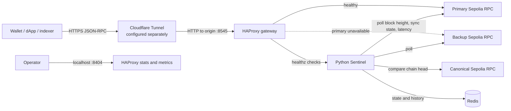

# DriftGuard

**An EVM JSON-RPC gateway with upstream health monitoring and active-passive failover.**

DriftGuard combines HAProxy, a Python Sentinel service, and Redis. HAProxy serves the gateway and routes JSON-RPC traffic to the primary provider while it is healthy, then to the configured backup when the primary is unavailable or Sentinel marks it unhealthy.

## Live Sepolia endpoint

**Gateway:** [https://rpc.maskal.space](https://rpc.maskal.space)<br>
**Network:** Ethereum Sepolia, chain ID `11155111`

Try it with curl:

```bash
curl -sS --fail-with-body -X POST \
  -H 'Content-Type: application/json' \
  --data '{"jsonrpc":"2.0","method":"eth_chainId","params":[],"id":1}' \
  https://rpc.maskal.space
```

```bash
curl -sS --fail-with-body -X POST \
  -H 'Content-Type: application/json' \
  --data '{"jsonrpc":"2.0","method":"eth_blockNumber","params":[],"id":1}' \
  https://rpc.maskal.space
```

The returned block number changes as Sepolia advances. A `GET` request to the endpoint displays the DriftGuard status page; JSON-RPC clients should use `POST`.

## Architecture



Cloudflare Tunnel is an external ingress layer and is not part of this Compose project. Configure its origin to reach the host's port `8545`. Docker Compose starts the gateway, Sentinel, and Redis services. The stats UI and Sentinel diagnostics are bound to localhost by default.

## Run it locally

Prerequisites: Docker Engine, Docker Compose v2, `curl`, and `git`.

```bash
git clone https://github.com/maskalfreeup-glitch/driftguard.git
cd driftguard
cp .env.example .env
```

Before starting, set unique values for `REDIS_PASSWORD` and `STATS_PASSWORD` in `.env`; do not use example or repository defaults in a public deployment. Keep `.env` private. Then start and inspect the services:

```bash
docker compose up -d --build
docker compose ps
```

Make a local JSON-RPC request:

```bash
curl -sS --fail-with-body -X POST \
  -H 'Content-Type: application/json' \
  --data '{"jsonrpc":"2.0","method":"eth_blockNumber","params":[],"id":1}' \
  http://127.0.0.1:8545
```

Useful local endpoints:

- HAProxy stats: <http://127.0.0.1:8404/stats>
- HAProxy Prometheus metrics: <http://127.0.0.1:8404/metrics>
- Sentinel status: <http://127.0.0.1:8000/status>
- Sentinel metrics: <http://127.0.0.1:8000/metrics>

## Failover evidence

The recorded Sepolia outage drill is in [evidence/failover-test.md](evidence/failover-test.md). In that run, the primary was deliberately pointed at port `444`; HAProxy marked it down, promoted the backup, and a request through the public endpoint returned a block number with HTTP 200. The primary was restored afterward and both upstreams were healthy again.

The evidence file records the tested provider, responses, and scope. Provider availability and free-tier limits can change, so repeat the drill against the providers configured in your own `.env` before relying on the result.

Run the included gateway checks with:

```bash
make test
make test-failover
```

## Operating cost

DriftGuard uses open-source software with no license fee. If you run it on infrastructure you already pay for, its **incremental software and hosting cost can be $0/month**. This is not a claim that a public deployment has no operating cost:

| Item | Cost treatment |
| --- | --- |
| HAProxy, Python, Redis, Docker Compose | No software license fee |
| Existing self-hosted machine or VM | No incremental compute charge if already paid for; power and hosting still have a cost |
| Domain, DNS, and tunnel service | Depends on your existing setup and provider plan |
| Public RPC providers | May be free for limited use; rate limits, terms, and availability vary |
| Production RPC capacity and monitoring | Budget according to traffic, provider SLAs, and redundancy requirements |

## Current scope and limitations

- The included configuration targets Ethereum Sepolia. It does not currently provide path-based Base or Optimism routing.
- Redis stores Sentinel telemetry and state; deterministic JSON-RPC response caching is not implemented.
- The gateway runs on one Docker host. Upstream failover does not protect against loss of that host, its network, or its tunnel.
- No latency benchmark is published here. Measure latency from the intended deployment region and workload before making performance claims.
- Public RPC endpoints are shared services. Review provider terms and use an appropriate RPC plan for production traffic.

## Configuration and security

- `.env` is ignored by Git; `.env.example` is the template. Never commit credentials, private keys, or provider tokens.
- Use unique, strong passwords and restrict access to the Docker host and its management ports.
- Keep stats and Sentinel management endpoints private unless they are protected by an authenticated access layer.
- Review provider TLS, rate-limit, and availability requirements before exposing the gateway to clients.

## License

MIT License. See [LICENSE](LICENSE).
