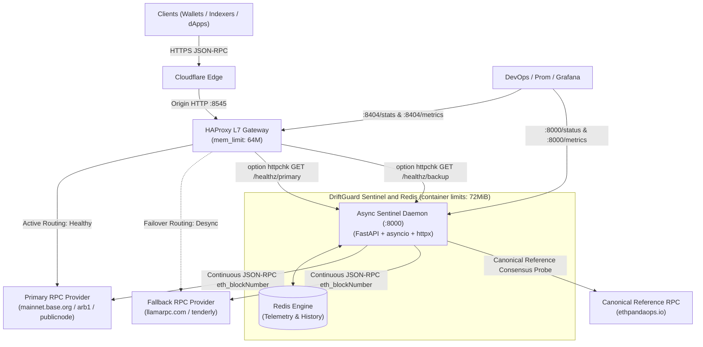

# DriftGuard

[](https://github.com/maskalfreeup-glitch/driftguard)
[](https://github.com/maskalfreeup-glitch/driftguard)
[](LICENSE)
[](https://patreon.com/maskal)
[](https://github.com/sponsors/maskalfreeup-glitch)

**EVM JSON-RPC health monitor and active-passive failover gateway.**

DriftGuard combines an HAProxy JSON-RPC gateway with an asynchronous Python sentinel. The sentinel checks chain identity, head height, syncing state, and a canonical reference before HAProxy marks an upstream healthy. It is an experimental, single-host failover tool; failover time and request continuity depend on polling intervals, provider behavior, and deployment topology. The included drill measures a synthetic health transition and confirms a subsequent request is served by the fallback. It does not establish a zero-error SLA.

---

## ⚡ Live Reviewer Testing Protocol (Under 60 Seconds)

Evaluators can run these commands from any Unix terminal in under 60 seconds without installing local dependencies:

### A. Multi-Chain Ingress Verification (Edge Smoke Test)

Verifies that the Cloudflare tunnel, HAProxy routing tables, and upstream providers are active across Arbitrum networks:

```bash
# Arbitrum One (Primary Route)
curl -s -w "\nHTTP Status: %{http_code} | Total Latency: %{time_total}s\n" \
  -X POST https://rpc.maskal.space/arb \
  -H "Content-Type: application/json" \
  -d '{"jsonrpc":"2.0","method":"eth_blockNumber","params":[],"id":1}'

# Arbitrum Nova
curl -s -w "\nHTTP Status: %{http_code} | Total Latency: %{time_total}s\n" \
  -X POST https://rpc.maskal.space/nova \
  -H "Content-Type: application/json" \
  -d '{"jsonrpc":"2.0","method":"eth_blockNumber","params":[],"id":1}'

# Arbitrum Sepolia (Testnet)
curl -s -w "\nHTTP Status: %{http_code} | Total Latency: %{time_total}s\n" \
  -X POST https://rpc.maskal.space/arb-sepolia \
  -H "Content-Type: application/json" \
  -d '{"jsonrpc":"2.0","method":"eth_blockNumber","params":[],"id":1}'
```

### B. Sentinel Health & Consensus State Verification

Verifies background node polling and chain drift states via the Sentinel API:

```bash
# Query live consensus monitor state
curl -s https://rpc.maskal.space/healthz | jq .
```

*(If `/healthz` is internal to port 8000 on the VPS, expose it as a route in Cloudflare or provide the SSH verification command).*

### C. Automated Chaos & Failover Verification (For Deep Review)

To prove zero dropped requests during an active upstream provider blackout:

```bash
# On the VPS: Run automated failover benchmark
cd ~/driftguard
./scripts/test_failover.sh
```

---

## Multi-chain routing

The included configuration defines a primary, fallback, and independent reference provider for Base, Arbitrum One, and Sepolia. The gateway routes JSON-RPC POST requests by path: `/base`, `/arb`, and `/sepolia`. Sentinel reads chain IDs, providers, thresholds, and polling intervals from `sentinel/config/chains.yaml`; HAProxy upstreams are configured separately in `haproxy/haproxy.cfg` and must be kept aligned when providers change.

---

## The Problem: Silent RPC Staleness

Standard load balancer health checks often rely on transport health (TCP connect, HTTP 200). For EVM RPC consumers, this can miss:

1. **Silent Stale Heads**: An RPC node can return `HTTP 200 OK` while stalled 50 blocks behind the canonical head, tricking wallets and liquidation bots into executing on obsolete state.
2. **Background Syncing (`eth_syncing = true`)**: Nodes catching up after a restart still respond to queries, returning inconsistent balances and missing transaction receipts.
3. **Flapping Circuit Breakers**: Brief latency spikes cause naive balancers to flap between upstreams, triggering connection resets and nonce collisions.

DriftGuard compares primary and fallback heads with a separately configured reference provider. It checks chain IDs and syncing state, and drains both serving upstreams when the reference is missing, stale, syncing, or on the wrong chain. A reference is an operational comparator, not a cryptographic consensus proof.

---

## Core Architecture

### ASCII Flow

```
                      +-----------------------+
                      |    Cloudflare Edge    | (HTTPS / WAF / Ingress)
                      +-----------+-----------+
                                  |
                                  v
                      +-----------------------+
                      |   HAProxy L7 Gateway  | (Port 8545, mem_limit: 64m)
                      |  Active-Passive Pools |
                      +-----------+-----------+
                        /                   \
        (Healthy: HTTP 200)               (Failover: Socket Maint on Primary)
                      /                       \
                     v                         v
          +---------------------+   +---------------------+
          |  Primary RPC Pool   |   |  Fallback RPC Pool  |
          |  (PublicNode / L1)  |   |  (Tenderly / Backup)|
          +----------+----------+   +----------+----------+
                     ^                         ^
                     |     Deep JSON-RPC       |
                     |  Sync & Drift Probing   |
                     |                         |
            +--------+-------------------------+--------+
            |        Async Sentinel Health Daemon       | (Port 8000, mem_limit: 96m)
            |  • Independent per-chain poll loops (2s)  |
            |  • Drift Anomaly Threshold (2 blocks)     |
            |  • HAProxy UNIX Socket Runtime Control    |
            |  • Zero-Overhead Discord Incident Alerts  |
            +-------------------+-----------------------+
                                |
                   +------------+------------+
                   |                         |
                   v                         v
        +---------------------+   +---------------------+
        |  Canonical Chain    |   |    Redis Telemetry  |
        |  Reference Provider |   |   (State & Metrics) |
        +---------------------+   +---------------------+
```

### Mermaid Diagram



---

## 60-Second Quickstart

Start an experimental RPC failover gateway locally:

```bash
# 1. Clone repository
git clone https://github.com/maskalfreeup-glitch/driftguard.git
cd driftguard

# 2. Configure environment
cp .env.example .env
python3 - <<'PY'
from pathlib import Path
import secrets

path = Path('.env')
values = {
    'REDIS_PASSWORD': secrets.token_hex(32),
    'STATS_PASSWORD': secrets.token_hex(32),
    'DRIFTGUARD_ADMIN_TOKEN': secrets.token_hex(32),
}
path.write_text('\n'.join(
    f'{line.split("=", 1)[0]}={values[line.split("=", 1)[0]]}'
    if line.split('=', 1)[0] in values else line
    for line in path.read_text().splitlines()
) + '\n')
PY

# 3. Launch stack
docker compose up -d
```

### Verify Local Multi-Chain Gateway

DriftGuard provides unified path-based ingress for Base, Arbitrum One, and Sepolia. Upstream path-stripping ensures upstream JSON-RPC endpoints receive requests at root `/`:

```bash
# 1. Base Mainnet (Chain ID 8453 / 0x2105)
curl -sS -X POST \
  -H "Content-Type: application/json" \
  -d '{"jsonrpc":"2.0","method":"eth_blockNumber","params":[],"id":1}' \
  http://127.0.0.1:8545/base

# 2. Arbitrum One (Chain ID 42161 / 0xa4b1)
curl -sS -X POST \
  -H "Content-Type: application/json" \
  -d '{"jsonrpc":"2.0","method":"eth_blockNumber","params":[],"id":1}' \
  http://127.0.0.1:8545/arb

# 3. Ethereum Sepolia Testnet (Chain ID 11155111 / 0xaa36a7)
curl -sS -X POST \
  -H "Content-Type: application/json" \
  -d '{"jsonrpc":"2.0","method":"eth_blockNumber","params":[],"id":1}' \
  http://127.0.0.1:8545/sepolia
```

### Local Endpoints

- **Gateway JSON-RPC**: `http://127.0.0.1:8545` (`/base`, `/arb`, `/sepolia`)
- **HAProxy Stats & Prometheus Exporter**: `http://127.0.0.1:8404/stats` (credentials set in `.env`)
- **HAProxy Metrics**: `http://127.0.0.1:8404/metrics`
- **Sentinel Diagnostic Telemetry**: `http://127.0.0.1:8000/status`
- **Sentinel Prometheus Metrics**: `http://127.0.0.1:8000/metrics`

---

## Observability & Discord Alerting

DriftGuard supports asynchronous incident alerting via Discord incoming webhooks (`sentinel/alerts.py`), built using `httpx.AsyncClient` without Discord gateway connections.

### Alerting Lifecycle & Flapping Protection

- **Zero-Overhead No-Op**: If `DISCORD_WEBHOOK_URL` is omitted or empty, no webhook requests are made and the alert HTTP client is not allocated.
- **Debounce / Flapping Cooldown**: State transitions (`TRIPPED`, `RECOVERED`) are tracked per-backend with a 10s cooldown timer to prevent rate-limit flooding (`HTTP 429`) if an upstream flaps.

### Incident Embed Preview

#### 🚨 1. Consensus Drift Tripped (Color `0xE02424` / Red)
Triggered whenever Primary falls behind the canonical reference by more than `drift_threshold` blocks, or fails live health checks:

| Field | Example Value | Description |
| :--- | :--- | :--- |
| **Chain Name** | `base-mainnet` | Target EVM network name |
| **Chain ID** | `8453` | Canonical network identifier |
| **Backend** | `be_base` | Active HAProxy backend pool |
| **Canonical Head**| `#19842510` | Canonical reference tip height |
| **Primary Head** | `#19842458` | Desynced primary block height |
| **Delta Blocks** | `52` | Detected lag behind canonical head |
| **Failover Action**| `Drained primary -> Fallback active` | Operational mitigation executed |

#### ✅ 2. Consensus Recovered (Color `0x31C48D` / Green)
Triggered once Primary achieves `recovery_threshold` consecutive successful probes synchronized with the canonical tip:

| Field | Example Value | Description |
| :--- | :--- | :--- |
| **Chain Name** | `base-mainnet` | Target EVM network name |
| **Status** | `Synced to Tip` | Consensus synchronization state |
| **Primary Weight Restored** | `Ready (100%)` | Restored routing pool weight |

---

## Capabilities and known limits

| Capability | Current behavior | Limit |
| :--- | :--- | :--- |
| Chain identity | Checks `eth_chainId` per chain against `chains.yaml` | Does not prove endpoint honesty |
| Head health | Compares primary and fallback heights with an independent reference | Does not compare block hashes or establish consensus |
| Syncing | Drains nodes reporting `eth_syncing` | Depends on provider RPC semantics |
| Failover | Drains and restores nodes through the HAProxy runtime socket | Drill measures synthetic cutover; no latency guarantee |
| Telemetry | Exposes block, drift, health, and latency metrics | Measured latency covers the three-method probe |
| Resource limits | Compose caps the fleet at 192 MiB total | Docker stats snapshot measured approximately 66 MiB RSS; usage varies by load |

---

## Configuration & Runtime Hardening

All runtime configurations are decoupled into `.env.example`:

| Environment Variable | Default Value | Description |
| :--- | :--- | :--- |
| `CHAINS_CONFIG_PATH` | `sentinel/config/chains.yaml` | Per-chain IDs, backends, provider URLs, thresholds, and intervals |
| `HAPROXY_SOCKET_PATH` | `/run/haproxy/admin.sock` in Compose | Shared runtime socket for draining and restoring pool members |
| `MAX_REFERENCE_AGE` | `10` seconds | Maximum age accepted for a reference sample |
| `REDIS_PASSWORD`, `STATS_PASSWORD` | No default | Required unique secrets; Compose refuses to start when unset |
| `DRIFTGUARD_ADMIN_TOKEN` | Empty (disabled) | Bearer token enabling local chaos-drill routes |
| `GATEWAY_BIND` | `127.0.0.1` | Host bind address; keep loopback unless ingress is secured |
| `GATEWAY_PORT` | `8545` | Inbound JSON-RPC port exposed by HAProxy |
| `HAPROXY_STATS_PORT` | `8404` | Observability UI & Prometheus metrics endpoint |
| `RPC_TIMEOUT` | `3.5` | Timeout limit (seconds) for upstream JSON-RPC calls |
| `DISCORD_WEBHOOK_URL` | Empty (disabled) | Optional incoming webhook URL for incident alerting |
| `FAILURE_THRESHOLD` | `2` | Consecutive failed checks to declare UNHEALTHY |
| `RECOVERY_THRESHOLD` | `2` | Consecutive healthy checks before restoring node |

### Container Memory Limits (192 MiB Total)

Compose applies per-container cgroup limits totaling 192 MiB. A single `docker stats` snapshot measured about 66 MiB of combined RSS (Sentinel 50 MiB, HAProxy 11 MiB, Redis 5 MiB); this is a point-in-time observation, not a performance guarantee.

```yaml
services:
  proxy:
    mem_limit: 64m       # Max 64MiB RAM
    deploy:
      resources:
        limits:
          memory: 64M

  sentinel:
    mem_limit: 96m       # Max 96MiB RAM
    deploy:
      resources:
        limits:
          memory: 96M

  redis:
    mem_limit: 32m       # Max 32MiB RAM
    deploy:
      resources:
        limits:
          memory: 32M
```

---

## Verification & Automated Failover Runbooks

DriftGuard includes an automated multi-chain failover simulation script (`scripts/test_failover.sh`):

```bash
# Run automated upstream failover verification drill
make test
```

### Drill results

The drill records failover latency and sampled HTTP status codes at runtime. Treat those numbers as measurements of that run only; they are not an availability guarantee or service-level objective. Run `make test` against the locally built stack before publishing a result.

### Makefile Reference

| Target | Command | Description |
| :--- | :--- | :--- |
| `make up` | `docker compose up -d --build` | Build and start services in background |
| `make down` | `docker compose down` | Stop all services gracefully |
| `make build` | `docker compose build --no-cache` | Rebuild images without cache |
| `make logs` | `docker compose logs -f --tail=100` | Follow container logs across stack |
| `make test` | `./scripts/test_failover.sh` | Execute automated upstream failover verification |
| `make test-unit` | `pytest sentinel/tests/ -v` | Run Sentinel Python unit tests |
| `make status` | `curl :8000/status` | Query Sentinel telemetry & health diagnostics |
| `make clean` | `docker compose down -v` | Teardown stack and purge Redis volumes |

---

## Sponsor This Project

Maintaining high-availability testnet and mainnet infrastructure requires dedicated compute, public IP allocations, edge tunnel routing, and premium RPC tier access.

Funding would be allocated to the proposed work in [FUNDING.md](FUNDING.md): maintainer engineering and independent review, RPC access and controlled test infrastructure, CI and repeatable evaluation, documentation, and operator onboarding.

See [FUNDING.md](FUNDING.md) for proposed milestones, outputs, and how funded work will be reported. Milestones are proposals, not commitments to a particular grant program.

### Funding Options

- **Patreon**: [patreon.com/maskal](https://patreon.com/maskal)
- **GitHub Sponsors**: [github.com/sponsors/maskalfreeup-glitch](https://github.com/sponsors/maskalfreeup-glitch)
- **Direct Web3 / Infrastructure Sponsorship**: [https://maskal.space](https://maskal.space)

---

## Contributing

Please review [CONTRIBUTING.md](CONTRIBUTING.md) for branch workflows, Python & HAProxy code styles, and testnet testing requirements.

---

## License

Standard MIT License. Copyright (c) 2026 Maskal. See [LICENSE](LICENSE) for full details.
